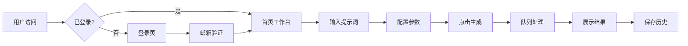

# XinMeng.ai - AI 创作平台产品需求文档

## 1. 产品概述

XinMeng.ai 是一个 AI 驱动的创作平台，用户可以通过输入提示词生成图片和视频内容。平台提供算力管理、积分系统、作品管理等功能，让创意与智能结合，开启无限可能。

- 目标用户：设计师、内容创作者、AI 爱好者
- 核心价值：降低 AI 创作门槛，提供一站式生成与管理体验

## 2. 核心功能

### 2.1 用户角色
| 角色 | 注册方式 | 核心权限 |
|------|----------|----------|
| 普通用户 | 邮箱验证码注册/登录 | 图片/视频生成、作品管理、积分消费 |
| 会员用户 | 充值升级 | 更高算力、优先队列、更多功能 |

### 2.2 功能模块
1. **首页（创作工作台）**：图片/视频生成、参数配置、生成结果展示、历史记录
2. **登录页**：邮箱验证码登录/注册
3. **无限画布**：可视化创作空间
4. **API 接口**：开发者接入
5. **模型广场**：浏览和选择 AI 模型
6. **作品管理**：历史生成内容管理
7. **设置**：用户偏好配置

### 2.3 页面详情
| 页面名称 | 模块名称 | 功能描述 |
|----------|----------|----------|
| 首页 | 顶部统计栏 | 剩余算力、今日用量、本月用量、积分余额、最近任务 |
| 首页 | 创作区域 | 图片/视频生成切换、参考图上传、提示词输入、参数配置 |
| 首页 | 生成结果区 | 结果展示、生成中状态、历史记录横向滚动 |
| 首页 | 右侧工具栏 | 下载、放大、再次编辑、复制参数、分享、收藏、删除 |
| 首页 | 左侧导航 | 首页、无限画布、API接口、模型广场、作品管理、设置等 |
| 登录页 | 品牌展示 | Logo、Slogan、3D 视觉元素 |
| 登录页 | 登录表单 | 邮箱输入、验证码输入、登录按钮、用户协议 |

## 3. 核心流程

### 3.1 用户登录流程
用户访问首页 → 未登录跳转登录页 → 输入邮箱 → 发送验证码 → 输入验证码 → 登录成功 → 返回首页

### 3.2 图片生成流程
用户进入首页 → 选择图片生成 → 上传参考图（可选）→ 输入提示词 → 配置参数（风格、尺寸、清晰度、数量）→ 点击生成 → 显示生成进度 → 展示结果 → 保存到历史记录

## 4. 用户界面设计

### 4.1 设计风格
- **主色调**：蓝紫色渐变（#4F46E5 → #7C3AED），科技感与梦幻感结合
- **辅助色**：白色背景、浅灰边框、绿色成功状态、红色警告
- **按钮样式**：圆角矩形，主按钮使用蓝紫渐变，带悬停光效
- **字体**：系统字体栈，标题加粗，正文常规
- **布局风格**：左侧固定导航 + 右侧主内容区，卡片式布局
- **图标风格**：线性图标，简洁现代

### 4.2 页面设计概览
| 页面 | 模块 | UI 元素 |
|------|------|---------|
| 首页 | 顶部栏 | 搜索框、会员/充值/积分/通知/头像 |
| 首页 | 统计卡片 | 算力进度条、用量数字、环比变化 |
| 首页 | 创作区 | 标签切换、上传区域、文本域、下拉选择 |
| 首页 | 结果区 | 图片网格、进度条、横向滚动历史 |
| 首页 | 侧边栏 | 图标+文字导航、收起展开 |
| 登录页 | 左侧面板 | 大 Logo、Slogan、3D 玻璃质感装饰 |
| 登录页 | 右侧面板 | 卡片式表单、渐变按钮、协议勾选 |

### 4.3 响应式设计
- 桌面端优先（1440px+）
- 平板端适配（768px-1440px）：侧边栏收起为图标模式
- 移动端（<768px）：底部导航栏，内容堆叠布局

## 5. 技术需求

### 5.1 性能要求
- 首屏加载 < 2s
- 图片生成进度实时更新（WebSocket 或轮询）
- 历史记录懒加载

### 5.2 安全需求
- 邮箱验证码防刷（60秒间隔）
- JWT Token 身份验证
- API 请求限流

### 5.3 部署需求
- 前端静态资源托管
- 后端服务部署到腾讯云服务器（129.204.225.231）
- Nginx 反向代理
