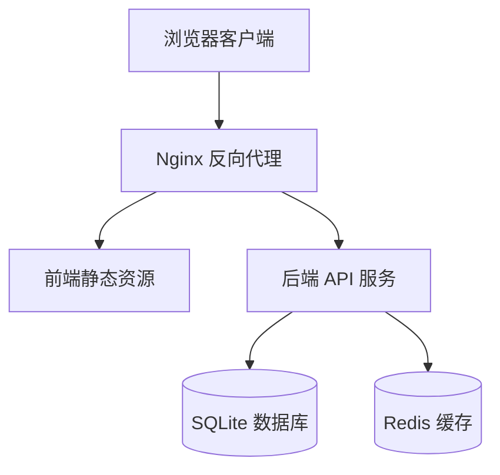
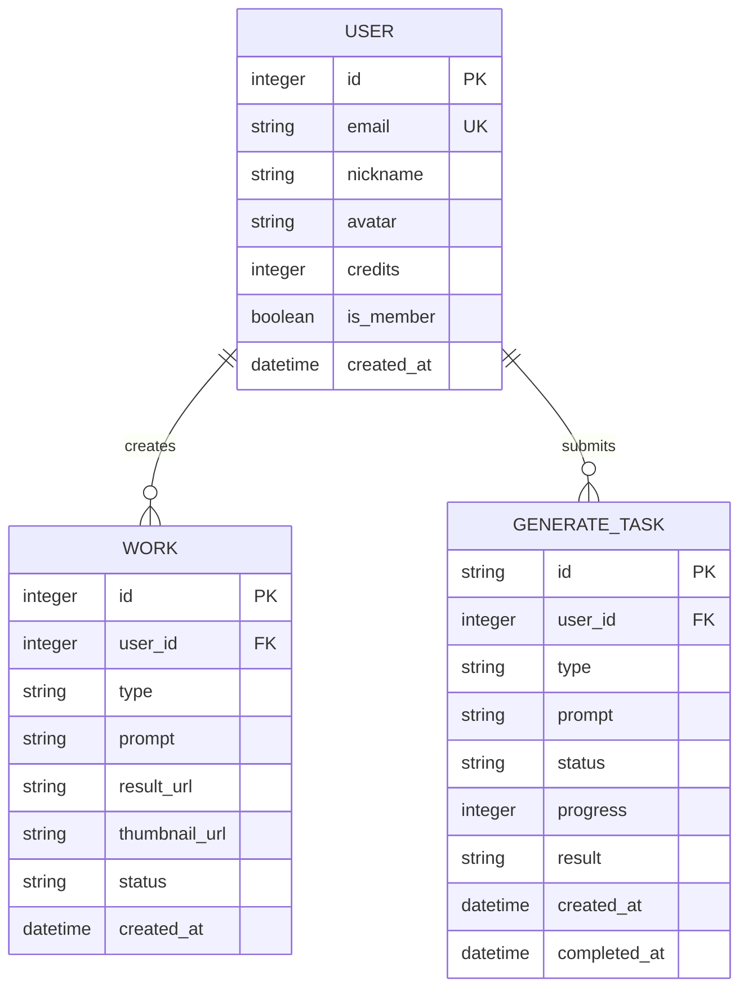
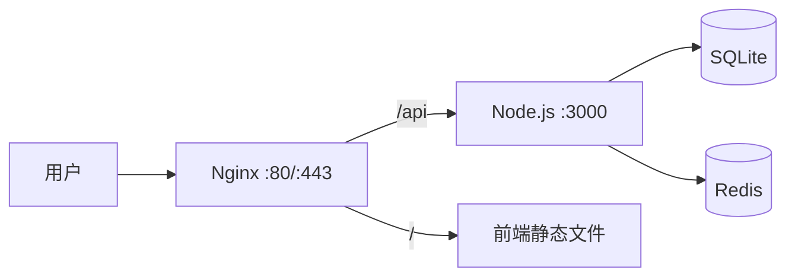

# XinMeng.ai - 技术架构文档

## 1. 架构设计



## 2. 技术选型

- **前端**：React 18 + TypeScript + Vite + Tailwind CSS + Zustand
- **后端**：Express.js + TypeScript + ESM
- **数据库**：SQLite（用户、作品、任务记录）
- **缓存**：Redis（验证码、会话、限流）
- **部署**：PM2 + Nginx

## 3. 路由定义

### 前端路由
| 路由 | 用途 |
|------|------|
| / | 首页（创作工作台） |
| /login | 登录页 |
| /canvas | 无限画布 |
| /api-docs | API 接口文档 |
| /models | 模型广场 |
| /works | 作品管理 |
| /settings | 设置 |

### 后端路由
| 路由 | 方法 | 用途 |
|------|------|------|
| /api/auth/send-code | POST | 发送邮箱验证码 |
| /api/auth/login | POST | 邮箱验证码登录 |
| /api/auth/me | GET | 获取当前用户信息 |
| /api/generate/image | POST | 提交图片生成任务 |
| /api/generate/video | POST | 提交视频生成任务 |
| /api/generate/status/:id | GET | 查询生成任务状态 |
| /api/works | GET | 获取作品列表 |
| /api/works/:id | DELETE | 删除作品 |
| /api/user/profile | GET | 获取用户资料 |
| /api/user/usage | GET | 获取用量统计 |

## 4. API 定义

### 4.1 发送验证码
```typescript
// Request
POST /api/auth/send-code
{
  email: string
}

// Response
{
  success: boolean,
  message: string
}
```

### 4.2 登录
```typescript
// Request
POST /api/auth/login
{
  email: string,
  code: string
}

// Response
{
  success: boolean,
  token: string,
  user: {
    id: number,
    email: string,
    nickname: string,
    avatar: string,
    credits: number,
    isMember: boolean
  }
}
```

### 4.3 提交生成任务
```typescript
// Request
POST /api/generate/image
{
  prompt: string,
  negativePrompt?: string,
  style: string,
  aspectRatio: string,
  quality: string,
  count: number,
  seed?: number,
  isPublic: boolean
}

// Response
{
  success: boolean,
  taskId: string,
  estimatedTime: number
}
```

### 4.4 查询任务状态
```typescript
// Response
{
  taskId: string,
  status: 'pending' | 'processing' | 'completed' | 'failed',
  progress: number,
  result?: string[],
  error?: string
}
```

## 5. 数据模型

### 5.1 ER 图


### 5.2 DDL
```sql
CREATE TABLE users (
    id INTEGER PRIMARY KEY AUTOINCREMENT,
    email TEXT UNIQUE NOT NULL,
    nickname TEXT,
    avatar TEXT,
    credits INTEGER DEFAULT 12860,
    is_member INTEGER DEFAULT 0,
    created_at DATETIME DEFAULT CURRENT_TIMESTAMP
);

CREATE TABLE works (
    id INTEGER PRIMARY KEY AUTOINCREMENT,
    user_id INTEGER NOT NULL,
    type TEXT NOT NULL,
    prompt TEXT NOT NULL,
    result_url TEXT,
    thumbnail_url TEXT,
    status TEXT DEFAULT 'processing',
    created_at DATETIME DEFAULT CURRENT_TIMESTAMP,
    FOREIGN KEY (user_id) REFERENCES users(id)
);

CREATE TABLE generate_tasks (
    id TEXT PRIMARY KEY,
    user_id INTEGER NOT NULL,
    type TEXT NOT NULL,
    prompt TEXT NOT NULL,
    negative_prompt TEXT,
    style TEXT,
    aspect_ratio TEXT,
    quality TEXT,
    count INTEGER,
    status TEXT DEFAULT 'pending',
    progress INTEGER DEFAULT 0,
    result TEXT,
    created_at DATETIME DEFAULT CURRENT_TIMESTAMP,
    completed_at DATETIME,
    FOREIGN KEY (user_id) REFERENCES users(id)
);

CREATE TABLE verify_codes (
    email TEXT PRIMARY KEY,
    code TEXT NOT NULL,
    expires_at DATETIME NOT NULL,
    created_at DATETIME DEFAULT CURRENT_TIMESTAMP
);
```

## 6. 部署架构



### 6.1 部署配置
- **服务器**：腾讯云 129.204.225.231
- **前端**：构建后静态文件通过 Nginx 服务
- **后端**：PM2 管理 Node.js 进程
- **数据库**：SQLite 文件存储
- **Nginx 配置**：反向代理 /api 到 Node 服务
