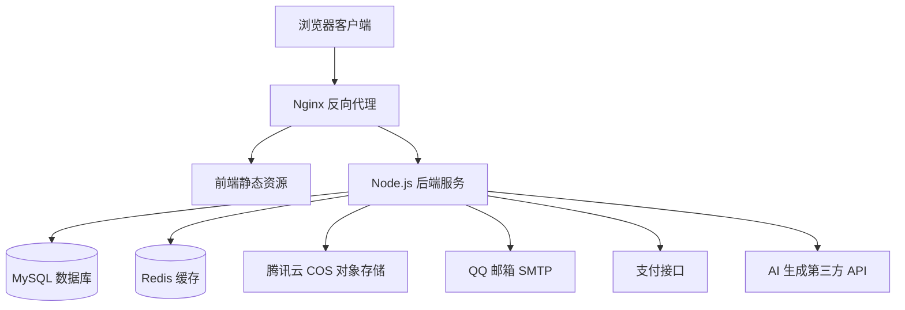
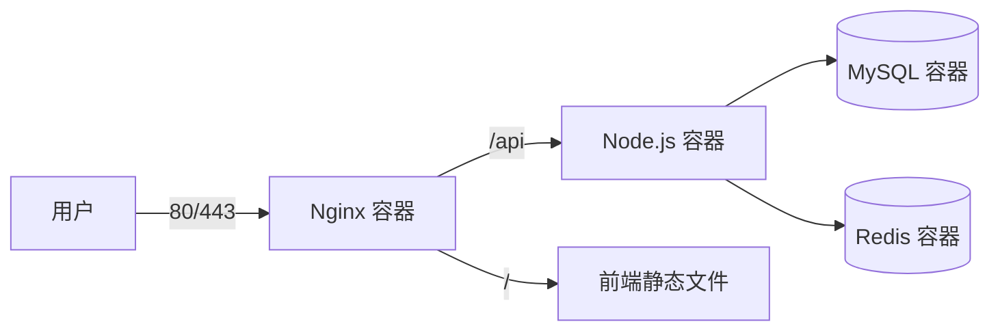

# XinMeng.ai - 技术架构文档

## 1. 架构设计



## 2. 技术栈

- **前端**: React 18 + TypeScript + Vite + Tailwind CSS + Zustand
- **后端**: Express.js + TypeScript + ESM
- **数据库**: MySQL 8.0 (持久化存储)
- **缓存**: Redis 7 (会话、验证码、限流、临时冻结)
- **对象存储**: 腾讯云 COS (图片、视频、素材)
- **部署**: Docker + Docker Compose (多容器)
- **邮件**: QQ 邮箱 SMTP
- **认证**: JWT (Bearer Token)

## 3. 容器架构

多容器部署架构，包含以下服务：

| 服务 | 镜像/类型 | 作用 |
|------|-----------|------|
| xinmeng-ai-frontend | Nginx | 反向代理，提供前端静态资源 |
| xinmeng-ai-backend | Node.js | 后端 API 服务 |
| xinmeng-ai-mysql | MySQL 8.0 | 数据持久化存储 |
| xinmeng-ai-redis | Redis 7-alpine | 缓存服务 |

网络隔离：
- backend-network: 后端服务间内部通信
- frontend-network: 前端与后端通信

## 4. 通信协议

- **协议**: HTTP/HTTPS
- **数据格式**: JSON
- **字符编码**: UTF-8

## 5. 身份鉴权

登录状态依靠 JWT Token 机制：

```
Authorization: Bearer <token>
```

- Token 有效期: 7 天
- 签名密钥: JWT_SECRET (环境变量)
- 携带位置: HTTP 请求头 Authorization
- Token 内容: { id, email, nickname, avatar, isAdmin }

### 鉴权中间件

- `authMiddleware`: 基础鉴权，验证 Token 有效性
- `authMiddlewareWithBanCheck`: 增强鉴权，包含用户封禁状态检查

## 6. 缓存服务 (Redis)

Redis 用于存储以下内容：

| 用途 | Key 格式 | TTL |
|------|----------|-----|
| 登录会话 | session:{userId} | 7天 |
| 邮箱验证码 | code:{email} | 10分钟 |
| 临时冻结算力 | freeze:{userId} | 可配置 |
| 接口限流规则 | rate_limit:{key} | 动态 |
| 热点数据缓存 | cache:{type}:{id} | 按需 |

### Redis 工具函数

```typescript
import { setCache, getCache, delCache, existsCache, incrCache } from './utils/redis'

await setCache('key', value, ttlSeconds)
await getCache<T>('key')
await delCache('key')
```

## 7. 数据存储

### 7.1 MySQL 数据库

存储结构化数据，包含以下核心表：

| 表名 | 用途 |
|------|------|
| users | 用户信息 (头像、积分、会员状态等) |
| works | 作品管理 (生成的图片/视频) |
| generate_tasks | 生成任务记录 (异步任务状态) |
| verify_codes | 验证码记录 |
| password_resets | 密码重置令牌 |
| orders | 订单记录 |
| credit_records | 积分变动记录 |
| api_channels | AI API 渠道配置 |
| settings | 系统设置 |
| admin_accounts | 管理员账号 |

### 7.2 云对象存储 (COS)

腾讯云 COS 用于存储文件资源：

- 生成的图片
- 生成的视频
- 用户上传的素材
- 用户头像

配置项 (环境变量):
- TENCENT_COS_SECRET_ID
- TENCENT_COS_SECRET_KEY
- TENCENT_COS_BUCKET
- TENCENT_COS_REGION
- TENCENT_COS_DOMAIN (可选)

## 8. 接口规范

### 8.1 统一响应格式

所有接口统一返回以下格式：

```typescript
{
  code: number,      // 0: 成功, 其他: 错误码
  msg: string,       // 提示信息
  data: any | null   // 响应数据
}
```

错误码定义:
- 0: 成功
- 400: 请求参数错误
- 401: 未授权/Token 无效
- 403: 禁止访问/账号封禁
- 404: 资源不存在
- 429: 请求过于频繁
- 500: 服务器内部错误

### 8.2 参数校验

所有接口使用 Zod 进行请求参数校验，防止恶意请求。

### 8.3 接口限流

- 通用限流: 15分钟 200次
- 发送验证码: 1分钟 3次
- 生成请求: 1分钟 10次

## 9. 异步任务

AI 绘图/视频等耗时操作采用异步处理模式：

```
1. 提交任务 → 返回 taskId
2. 前端轮询 /api/generate/status/{taskId}
3. 任务状态: pending → processing → completed/failed
```

## 10. 第三方对接

### 10.1 QQ 邮箱 SMTP

配置项:
- SMTP_HOST: smtp.qq.com
- SMTP_PORT: 587
- SMTP_USER: 邮箱账号
- SMTP_PASS: SMTP 授权码
- SMTP_FROM: 发件人

功能:
- 发送登录验证码
- 发送密码重置邮件

### 10.2 支付接口

个人 T+0 支付接口 (待实现)

### 10.3 AI 生成 API

支持多渠道配置:
- 图片生成 API
- 视频生成 API

渠道配置存储在 api_channels 表中，支持权重分配和自动故障转移。

## 11. 部署架构



### 11.1 环境变量

参考 `.env.example` 配置以下变量:

```env
NODE_ENV=production
PORT=3001
HOST_IP=localhost

JWT_SECRET=your-jwt-secret-here
ADMIN_JWT_SECRET=your-admin-jwt-secret-here

DB_HOST=xinmeng-ai-mysql
DB_PORT=3306
DB_USER=xinmeng
DB_PASSWORD=your-db-password-here
DB_NAME=xinmeng
DB_ROOT_PASSWORD=your-db-root-password-here

REDIS_HOST=xinmeng-ai-redis
REDIS_PORT=6379

FRONTEND_URL=http://localhost

SMTP_HOST=smtp.qq.com
SMTP_PORT=587
SMTP_USER=your-email@qq.com
SMTP_PASS=your-smtp-auth-code
SMTP_FROM=your-email@qq.com
SITE_NAME=新梦AI

TENCENT_COS_SECRET_ID=your-cos-secret-id
TENCENT_COS_SECRET_KEY=your-cos-secret-key
TENCENT_COS_BUCKET=your-bucket
TENCENT_COS_REGION=ap-guangzhou
TENCENT_COS_DOMAIN=your-cos-domain.com
```

### 11.2 Docker Compose 启动

```bash
# 开发环境
docker-compose up -d

# 生产环境
docker-compose -f docker-compose.prod.yml up -d
```

## 12. 安全措施

- Helmet 安全头
- CORS 白名单控制
- SQL 注入防护 (参数化查询)
- XSS 防护
- 暴力破解防护 (登录尝试追踪)
- IP/设备黑名单
- 审计日志
